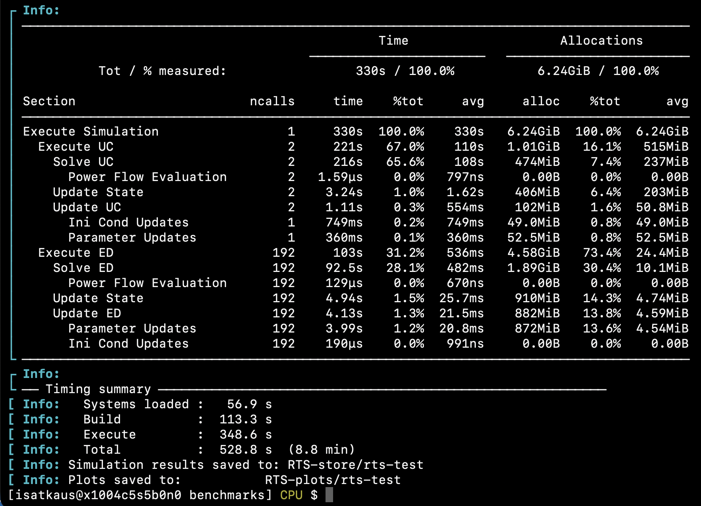
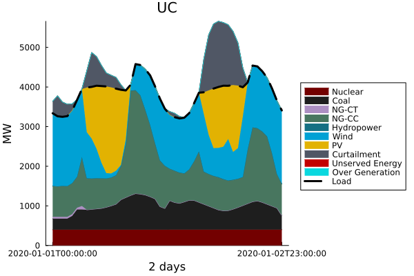
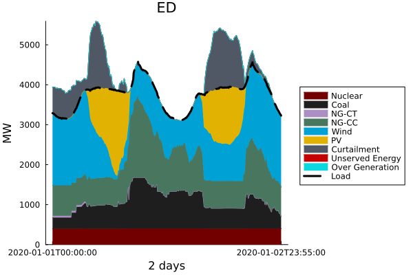

# Sienna

## Purpose and Description

The purpose of this benchmark is to test the functionality of the Julia programming language, the Sienna framework, and two types of solvers commonly used to solve optimization problems for power grid operations and planning: interior point and mixed integer solvers. The **Sienna framework** is an open-source ecosystem for simulation and optimization of modern energy systems. It is designed to model, solve, and analyze scheduling problems and dynamic simulations of quasi-static infrastructure systems.

Sienna consists of three main modules: **Sienna\Data**, **Sienna\Dyn**, and **Sienna\Ops**. This benchmark will focus on exercising **Sienna\Ops**, which enables simulation of system scheduling, including unit commitment, economic dispatch, automatic generation control, and nonlinear optimal power flow. The framework applies advanced computer science, visualization, applied mathematics, and computational science to create a flexible modeling environment for energy systems.

Users running this benchmark will be interacting primarily with `PowerSystems.jl` and `PowerSimulations.jl` packages from the Sienna framework.
`PowerSystem.jl` is the package that is used for creating and storing the power system that is being modeled. It stores the system as a JSON file and uses an H5 file to store timeseries data.
`PowerSimulations.jl` uses the `sys.json` created and loaded into the memory by PowerSystems.jl to create a simulation model and solve it using an MILP or NLP solver such as HiGHS or IPOPT, respectively.

## Licensing Requirements

Sienna is open-source software. Licensing details for its components can be found on the [Sienna GitHub repository](https://github.com/NREL-Sienna). 

## Other Requirements

Sienna requires Julia as the primary programming language and depends on several Julia packages, including `PowerSimulations.jl` and `PowerSystems.jl`.

## How to build and Run

### Instructions to build and install Sienna components:

1. Install Julia from [JuliaLang.org](https://julialang.org/). Specifically, we recommend using the [Manual Downloads](https://julialang.org/downloads/manual-downloads/), and selecting the current stable release appropriate for the target architecture. Below we show two options for building the Julia environment (in our tests we used Julia v1.12.5). 

#### Option 1: Use existing Project.toml and Manifest.toml files
In terminal do:
```
cd ESIFHPC4/Sienna-Ops/benchmarks 
julia --project=. -e 'using Pkg; Pkg.instantiate(); Pkg.build()'
```

This should install all the packages needed to run the benchmark


#### Option 2: Build your own Julia environment (with exact versions we used) via setup.jl
Either
```
cd ESIFHPC4/Sienna-Ops/benchmarks
rm Project.toml
rm Manifest.toml
julia setup.jl
```
Or in a new project dir
```
cd /project/dir
julia setup.jl
```

#### Option 3: Build your own Julia environment(flexible, less pinned versions) via REPL
Similarly, either delete existing `Project.toml` and `Manifest.toml` in `ESIFHPC4/Sienna-Ops/benchmarks` dir or start in a new project dir.
Add the required packages using the Julia package manager:
```
cd ESIFHPC4/Sienna-Ops/benchmarks
rm Project.toml
rm Manifest.toml 
julia --project=.
]
activate .

add PowerSystems@5 PowerSimulations@0.32 PowerSystemCaseBuilder@2 HiGHS HydroPowerSimulations Ipopt PowerAnalytics PowerGraphics

instantiate
status
```


### Instructions on how to run the Sienna benchmark

#### Running the benchmark from the command line (ignore all Info and Warning messages)
1. Run the benchmark as follows
```
cd ESIFHPC4/Sienna-Ops/benchmarks
julia --threads=auto --project=. run_RTS_UC-ED.jl
```

#### How we ran this benchmark on Kestrel:
1. Modify and run the sbatch file `run_benchmarks.sh` as follows

```shell
sbatch run_benchmarks.sh 1 
sbatch run_benchmarks.sh auto
```

Note: The argument after `run_benchmarks.sh` specifies how many threads julia should be started with. By default, Julia uses only one thread. Setting the number of threads to `auto` means that Julia will set the number of threads to be equal to the number of cores on the system.

## Run Definitions and Requirements

- The benchmark runs 2 days of PCM simulation: 2 Unit Commitment and 2x96 Economic Dispatch simulations using `HiGHS` and `Ipopt` solvers respectively.
- The `run_RTS_UC-ED.jl` script is compatible with `PowerSystems v5` and `PowerSimulations v0.32`. While it is possible to use other package versions, parsing errors might occur. 
 

## Run Rules
- The Benchmark is single node only.
- GPU-compatible Optimizers that are compatible with Julia JuMP may be exercised on GPU nodes if desired. However, this is not a requirement.
- This benchmark has been set up to run using two open source solvers: `HiGHS` and `Ipopt`. Proprietary solvers such as `Gurobi` and `Xpress` may be used instead, but are not required.

## Benchmark test results to report and files to return

The `run_RTS_UC-ED.jl` script will create simulation results and plots in `RTS-store` and `RTS-plots` dirs, respectively. Each run `k`, of the script will create a new dir `rts-test<k>`, inside `RTS-store` and `RTS-plots` dirs (or `cleanup.sh` to remove previous run results). These directories with at least one successful run `rts-test` are to be returned. To check for correctness (successful functionality test):
1.  Script `run_RTS_UC-ED.jl` finishes without errors and at the end of an interactive session, you see:


2. Two plots, `UC.png` and `ED.png` inside `RTS-plots/rts-test/` look similar to these:




